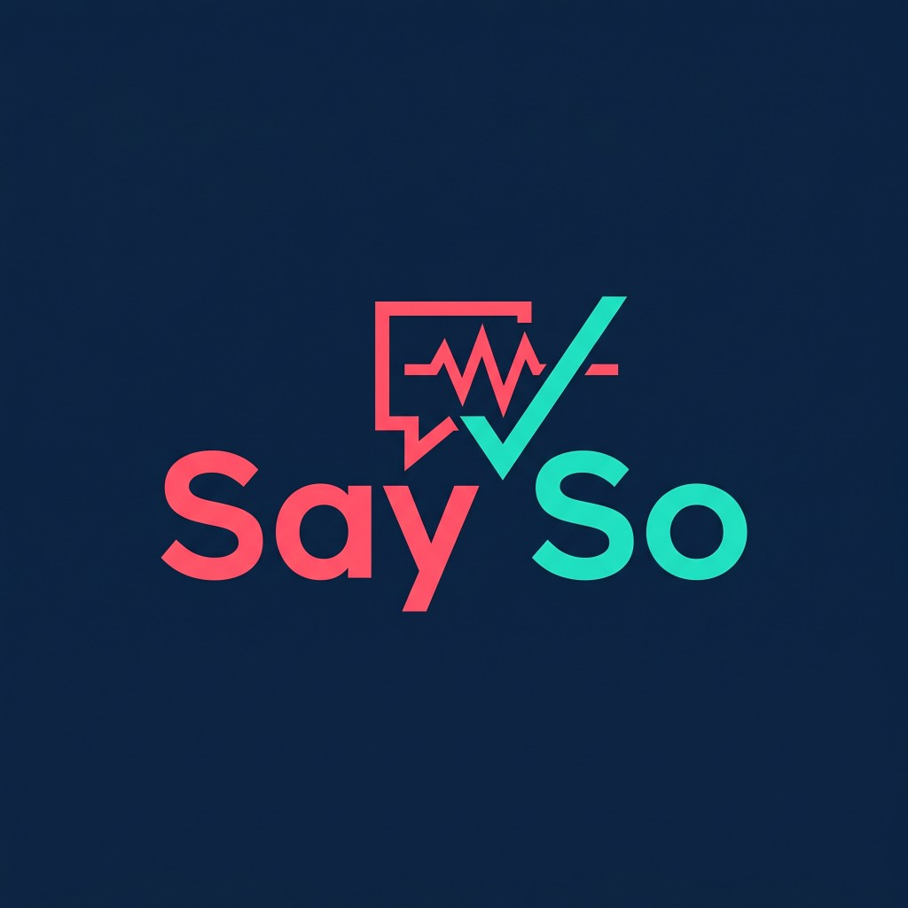
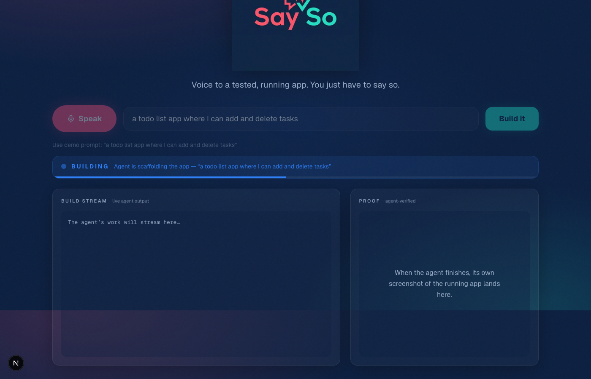
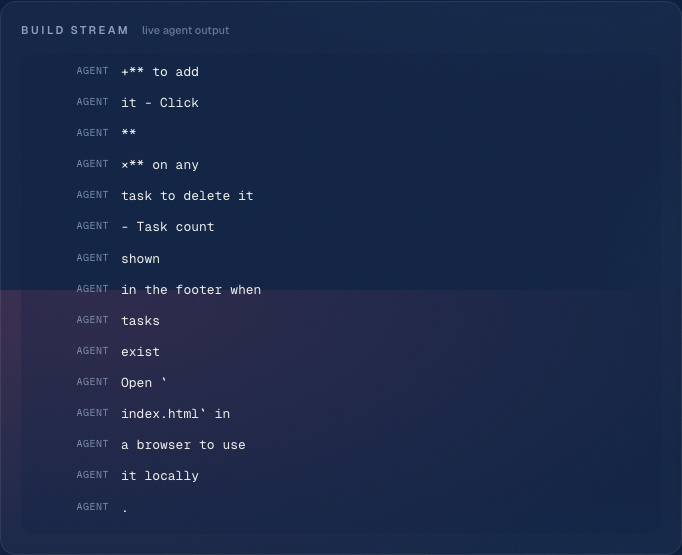
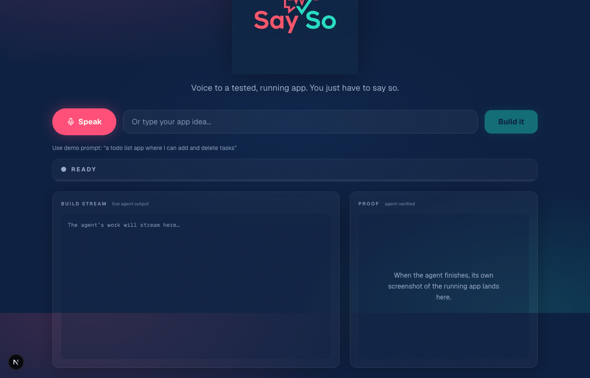
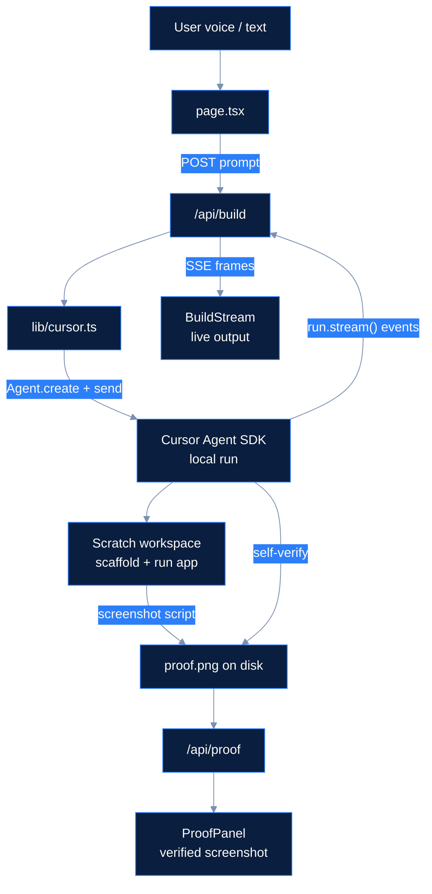

  

# Say So

**Voice to a tested, running app. You just have to say so.**

Most coding agents write code and hope it works. Say So uses the Cursor Agent SDK to scaffold a real app from your voice (or a typed prompt), run it in a scratch workspace, and verify its own work — then surfaces the agent's own screenshot as proof. You watch the build stream live; the payoff is an artifact the agent took, not a slide deck claim.

**The demo beat:** speak → build streams live → agent screenshots the running app → proof appears.

## Run it (3 steps)

1. `npm install` then `npx playwright install chromium` (one-time, for the proof screenshot)
2. Put your Cursor API key in `.env.local`: `CURSOR_API_KEY=cursor_...`
3. `npm run dev` and open http://localhost:3000 in Chrome

Click **Speak** (or type) and say: _"a todo list app where I can add and delete tasks."_

## Screenshots

*Mid-build: the agent's work streams in real time — edits, shell commands, and narration.*

*The win condition: a screenshot the agent took of an app it built seconds ago, not ours.*

*Full screen after a successful run — one page, three zones, demo-ready from across the room.*

## Architecture

Stream events flow from the SDK run through `/api/build` (SSE over a `ReadableStream`) to `BuildStream` for the entire build. When the run finishes, the proof image is read from disk and rendered in `ProofPanel`.

**Design constraint:** the Cursor Agent SDK allows one active run per agent — a second concurrent run returns `409 agent_busy`. Say So respects this: one user request creates one fresh agent, then disposes it when done.

## How it works

| Path | Role |
|------|------|
| `app/page.tsx` | Single-screen UI: mic/text input, status bar, build stream, proof panel |
| `app/api/build/route.ts` | POST → local agent run → normalized events streamed as SSE (Node runtime) |
| `app/api/proof/route.ts` | GET → serves the screenshot the agent wrote to disk |
| `lib/cursor.ts` | `Agent.create` (local) → `send` → map `run.stream()` to UI events → `wait` |
| `lib/scratch.ts` | Reset scratch workspace; pre-seed one-command Playwright screenshot helper |
| `lib/prompts.ts` | Prescriptive build + self-verify prompt (scaffold, run, screenshot to known path) |

The agent runs **locally** against a temp scratch directory outside the Next.js project. The screenshot is read straight off disk — no reliance on undocumented SDK artifact fields.

## Stack

Next.js 16 · React 19 · `@cursor/sdk` · Web Speech API (text fallback) · Playwright (proof capture) · Motion (proof reveal)

## Capturing the screenshots

During a real end-to-end run (`npm run dev`, demo prompt, wait for proof):

1. **Build stream mid-run** — while the agent is editing files or running shell commands, capture the left panel. Save as `docs/images/build-stream-mid-run.png`.
2. **Proof panel** — when the verified screenshot and badge appear, capture the right panel (or crop tight). Save as `docs/images/proof-panel.png`.
3. **Full UI hero** — after status shows Done, capture the full browser window. Save as `docs/images/hero-full-ui.png`.

Create `docs/images/` if it doesn't exist. Remove the `<!-- TODO -->` comments above each embed once the files are in place.
